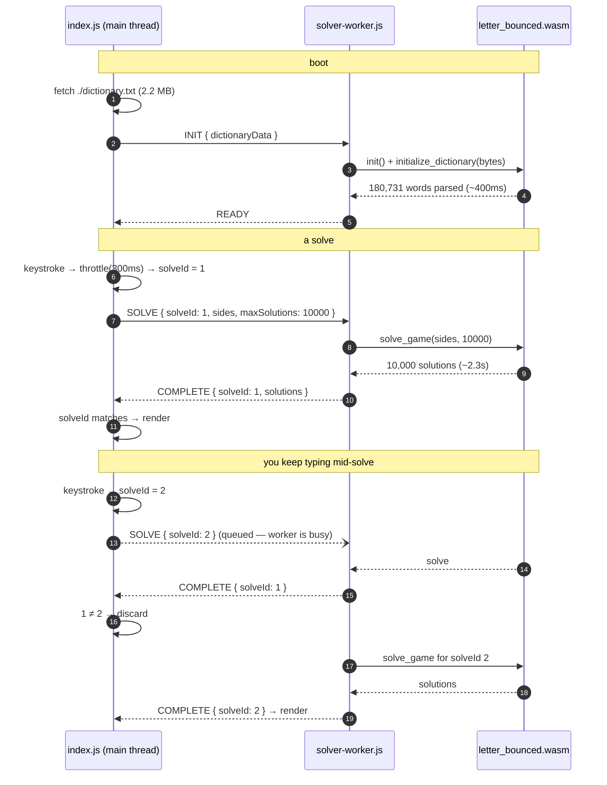

# Letter Bounced — how the website works

The site is at <https://neilk.github.io/letterbounced/>. It's a static bundle on GitHub
Pages — no server, no API, and at this time, not even any analytics.

## Using it

<table>
<tr>
<td width="33%"></td>
<td width="33%"></td>
<td width="33%"></td>
</tr>
</table>

Note there isn't a "Solve" button. The solver runs whenever the puzzle changes. You can
type letters yourself, load some presets, or load today's New York Times puzzle. (That's
scraped by a periodic job on Github Actions. See the README.)

You get the first 10,000 solutions, bucketed by word count, and sorted by an arbitrary
score that I made up which tries to sort more ordinary words first.

Your board is stashed in `localStorage` under `letterBoxedPuzzle`, so a reload picks up
where you left off — and immediately re-solves, since a restored board is just another
board change.

There is a bouncing animation whenever a letter changes. I have some ambitions to turn this
into a game with more, well, bounciness. For now it's just a flourish.

## How solving works

### One Rust core, three front ends

The solver is pure, plain Rust in `src/{board,dictionary,solver}.rs`, and doesn't do any I/O.
Around it sit three thin shells:

| Shell | File | What it does |
| --- | --- | --- |
| CLI | `src/main.rs` | clap arg parsing, prints to stdout |
| WASM | `src/wasm.rs` | `#[wasm_bindgen]` exports, gated on `#[cfg(target_arch = "wasm32")]` |
| Build tool | `src/dictionary_builder.rs` | offline dictionary prep, its own binary |

So the CLI isn't the app with a web version bolted on; it's just another caller. The WASM
shell exports three functions — `initialize_dictionary`, `solve_game`,
`cancel_current_solve` — and `solve_game` returns a `Promise` via `future_to_promise`.
Hold that thought.

### Three files, three jobs

`npm run build` emits a `dist/` that looks roughly like this:

```
dist/assets/index-Bf7Ne_iy.js            45 KB   Svelte app, main thread
dist/assets/solver-worker-C1Kn0FFQ.js     7 KB   worker entry
dist/assets/letter_bounced_bg-DNWSUsk8.wasm   87 KB   the actual solver
dist/dictionary.txt                      2.2 MB  fetched at runtime, not bundled
```

We use a "solver worker" - a Web Worker - to do the actual solving in WASM. That stays off
the main UI thread, to keep everything snappy.

The dictionary stays a separate 2.2 MB text file (700 KB over the wire, gzipped).
Rust parses it into 180,731 words in less than a second, and parks it into a
`OnceLock<Arc<Dictionary>>` for the life of the page.

### Why there's no Solve button

Because it's fast.

| Board | Time | Result |
| --- | --- | --- |
| `VYQ FIG OTE XLU` | 276ms | 1,524 solutions — exhaustive |
| `PRC YAN LKH SIO` | 749ms | hit the 10,000 cap |
| `JGH NVY EID ORP` | 2,357ms | hit the 10,000 cap |

A sparse board finishes before you've lifted your finger. A dense one runs until it hits
the hardcoded 10,000-solution cap, and how long that takes depends on how lucky the search
order gets.

Three things keep that from turning into a mess when you type quickly:

1. **A 300ms throttle** on the main thread, so a burst of keystrokes collapses into one or
   two solves rather than twelve.
2. **A monotonic `solveId`.** Every `solvePuzzle()` bumps a counter and stamps the outgoing
   message. When a result comes back, the store compares stamps and drops anything stale.
3. **Short circuit** an incomplete or impossible board doesn't do anything.



## The UI

### CSS, hand-written, no framework

There is no Tailwind, no component library, no CSS-in-JS. Just Svelte's scoped `<style>`
blocks plus a global `app.css` for the theme variables.

I found some nice CSS tricks for the box layout - it's a 5x5 CSS grid. Each input is placed by HTML ID.
`aspect-ratio: 1` keeps it square and
`font-size: clamp(24px, 8vw, 80px)` scales the letters. The jump animation is four
keyframe sets — `jump-up`, `jump-right`, `jump-down`, and `jump-left` .

### Dark mode, by lightness inversion

Every colour in the app is a CSS custom property — `--color-text`, `--color-bg-container`,
and 21 others — defined on `:root` and overridden in a
`@media (prefers-color-scheme: dark)` block. Nothing hardcodes a hex value in a component.

The dark values weren't picked by hand. They were generated by
[`endarken-color.js`](../web/svelte-app/endarken-color.js), which is about as dumb as a
colour tool can be while still working: convert to HSL, do `l = 100 - l`, convert back.
Hue and saturation are untouched.
