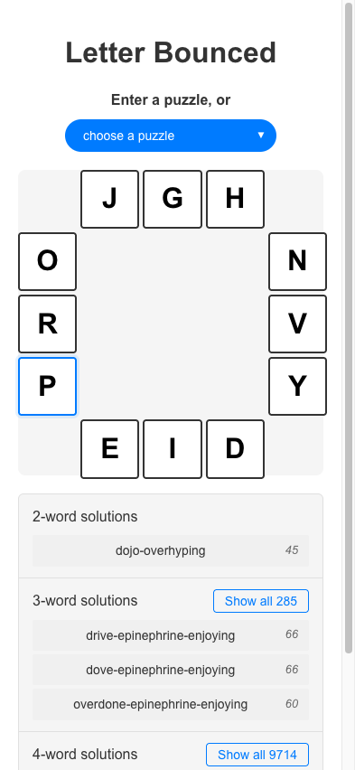
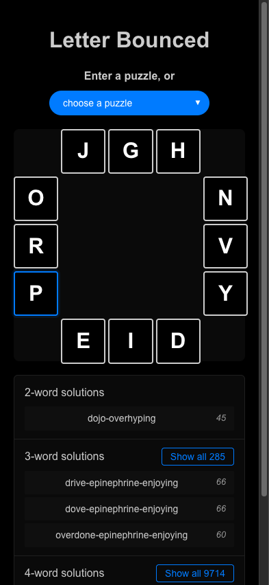
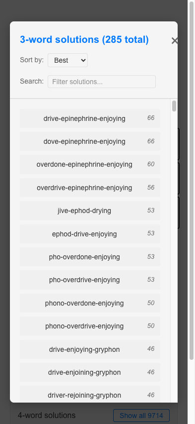
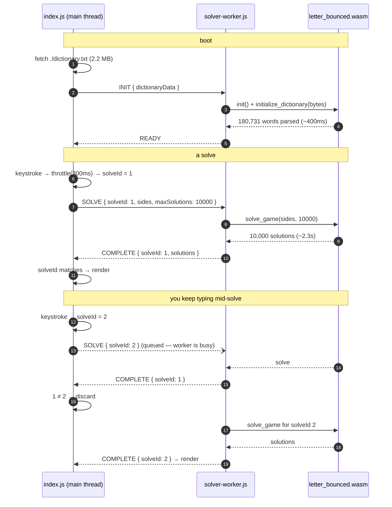
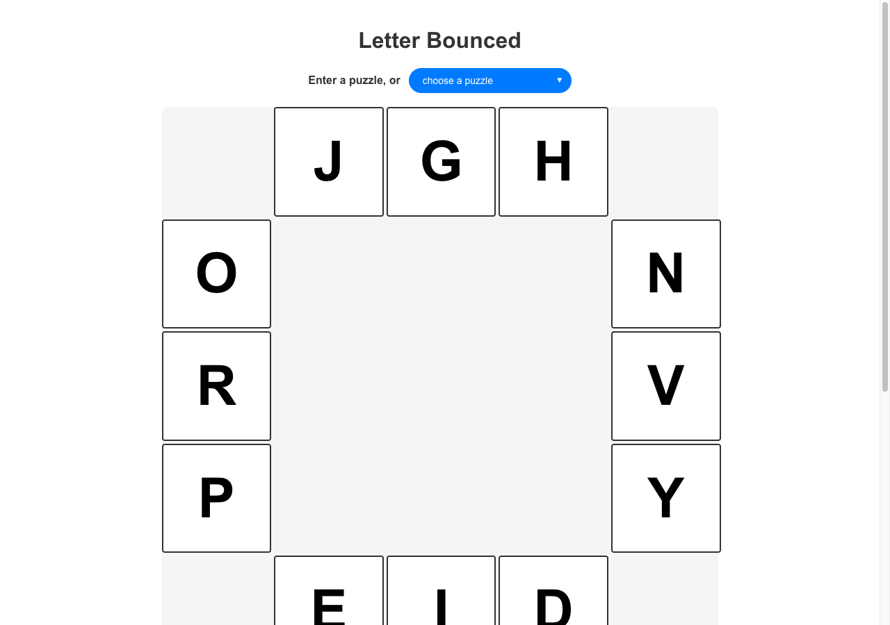

# Letter Bounced — how the website works

Notes on the web front end, for people who like this sort of thing. This isn't operating
documentation; it's a tour of the bits that turned out to be interesting.

The site is at <https://neilk.github.io/letterbounced/>. It's a static bundle on GitHub
Pages — no server, no API, no analytics. Everything below happens in your browser.

## Using it

<table>
<tr>
<td width="33%"></td>
<td width="33%"></td>
<td width="33%"></td>
</tr>
</table>

There is no "Solve" button, and that's the whole design.

Type letters into the twelve boxes and solutions appear underneath. Every keystroke kicks
off a new solve. The `⌄ choose a puzzle` pill loads a whole board at once — six samples,
plus today's New York Times puzzle (which comes from a static JSON file scraped by a cron
workflow, not from nytimes.com — see the README).

Solutions are bucketed by word count, best-scoring first, with the top three of each
bucket inline and a **Show all** button for the rest. The modal gets sort and filter
controls, because a board like `JGH NVY EID ORP` has 285 three-word solutions and 9,714
four-word ones, and scrolling that is not a user experience.

Your board is stashed in `localStorage` under `letterBoxedPuzzle`, so a reload picks up
where you left off — and immediately re-solves, since a restored board is just another
board change.

A couple of small touches: letters animate outward from the centre when a puzzle loads
(clockwise, 50ms apart, each side jumping in its own direction), the fields auto-advance
as you type, and backspace on an empty field walks you backwards.

## How solving works

### One Rust core, three front ends

The solver is plain Rust in `src/{board,dictionary,solver}.rs`, with no idea it's on the
web. Around it sit three thin shells:

| Shell | File | What it does |
|---|---|---|
| CLI | `src/main.rs` | clap arg parsing, prints to stdout |
| WASM | `src/wasm.rs` | `#[wasm_bindgen]` exports, gated on `#[cfg(target_arch = "wasm32")]` |
| Build tool | `src/dictionary_builder.rs` | offline dictionary prep, its own binary |

So the CLI isn't the app with a web version bolted on; it's just another caller. The WASM
shell exports three functions — `initialize_dictionary`, `solve_game`,
`cancel_current_solve` — and `solve_game` returns a `Promise` via `future_to_promise`.
Hold that thought.

### Three files, three jobs

`npm run build` emits a `dist/` that looks roughly like this:

```
dist/assets/index-Bf7Ne_iy.js            45 KB   Svelte app, main thread
dist/assets/solver-worker-C1Kn0FFQ.js     7 KB   worker entry
dist/assets/letter_bounced_bg-DNWSUsk8.wasm   87 KB   the actual solver
dist/dictionary.txt                      2.2 MB  fetched at runtime, not bundled
```

`index.js` never touches the WASM. It owns the DOM and a `Worker`, and talks to it in
`postMessage` only. `solver-worker.js` is the small shim Vite splits out when it sees the
`new Worker(new URL('../workers/solver-worker.ts', import.meta.url), { type: 'module' })`
idiom; it imports the wasm-bindgen glue, which streams in the `.wasm`.

The dictionary stays a separate 2.2 MB text file (700 KB over the wire, gzipped) rather
than being baked into the binary. The main thread `fetch`es it, `TextEncoder`s it to a
`Uint8Array`, and ships it to the worker once at boot; Rust parses it into 180,731 words in
about 400ms and parks it in a `OnceLock<Arc<Dictionary>>` for the life of the page.

### Why a worker

A solve is a synchronous recursive search that can run for a couple of seconds. On the main thread
that's a visibly janky page — dropped keystrokes, stalled animations. In a worker it's
somebody else's problem: the UI thread stays free to echo your typing at 60fps while the
search runs. That's the entire justification, and it's a good one.

### Why there's no submit button

Because a solve is fast enough that asking permission would be silly. Measured in the
browser, warm:

| Board | Time | Result |
|---|---|---|
| `VYQ FIG OTE XLU` | 276ms | 1,524 solutions — exhaustive |
| `PRC YAN LKH SIO` | 749ms | hit the 10,000 cap |
| `JGH NVY EID ORP` | 2,357ms | hit the 10,000 cap |

A sparse board finishes before you've lifted your finger. A dense one runs until it hits
the hardcoded 10,000-solution cap, and how long that takes depends on how lucky the search
order gets.

Three things keep that from turning into a mess when you type quickly:

1. **A 300ms throttle** on the main thread, so a burst of keystrokes collapses into one or
   two solves rather than twelve.
2. **A monotonic `solveId`.** Every `solvePuzzle()` bumps a counter and stamps the outgoing
   message. When a result comes back, the store compares stamps and drops anything stale.
3. **An incomplete board short-circuits.** Until all twelve fields hold a letter, the
   reactive block clears solutions immediately without going near the worker.



### An honest note on "interruptible"

That last block of the diagram is not what the code was written to do, and it's worth
spelling out, because the gap is invisible from the outside.

The Rust side is built for cancellation. `Solver::solve_cancellable` takes an
`Arc<AtomicBool>` and checks it at the top of every `search_recursive` call — a tight
check, so latency to abandon a search should be microseconds. `wasm.rs` keeps a
`CURRENT_SOLVE` mutex, compares the incoming board against the running one, and flips the
old cancel flag when they differ. There's a `cancel_current_solve` export and a `CANCEL`
message type to go with it.

None of it fires. Two reasons:

- **`cancelSolve()` is never called.** It's exported from the store and no component
  imports it, so the `CANCEL` branch in the worker is dead code.
- **The worker can't hear you anyway.** `solve_game` returns a Promise, but the async block
  inside `future_to_promise` has no `.await` in it — the search runs straight through on
  the first poll. That blocks the worker's event loop, so a second `SOLVE` message sits in
  the queue until the first solve finishes. By the time the params-differ check in
  `solve_game` runs, the previous task has already completed and cleared itself.

Instrumenting a real session makes this plain: change a letter mid-solve and
`Cancelling previous solve with different params` never logs. The stale solve runs to
completion, its result is thrown away by the `solveId` check, and only then does the new
one start. Worst case the user waits out two full solves — about 5.4s in the trace I
captured, against the ~2.3s a true interrupt would have cost.

It's correct, just wasteful. Nobody notices because the throttle keeps the queue to about
one pending solve and the solves are short. Making it real would mean yielding to the event
loop periodically inside the search — chunking the recursion across `setTimeout(0)` or
similar — so the worker can actually drain its inbox mid-search. Filed under "works fine,
would be nicer".

### A thing that doesn't matter

`App.svelte` slices the twelve fields into four sides and labels them `top, right, bottom,
left`. Two of those labels are wrong — the slice it calls "bottom" is the left column, and
vice versa. The comments have been wrong for ages and nothing broke, because the solver
treats a board as a *set of sets*: it only cares which letters are grouped together, never
which group is which. Side order is unobservable.

## The UI

### CSS, hand-written, no framework

There is no Tailwind, no component library, no CSS-in-JS. Just Svelte's scoped `<style>`
blocks plus a global `app.css` for the theme variables. The whole stylesheet is 11 KB
uncompressed, 2.6 KB gzipped, and the entire app bundle is around 21 KB gzipped.

The letter box itself is one nice trick: a `5×5` CSS grid where each of the twelve inputs
is explicitly placed by ID (`#char00 { grid-column: 2; grid-row: 1; }`), leaving the four
corners and the middle 3×3 empty. `aspect-ratio: 1` keeps it square and
`font-size: clamp(24px, 8vw, 80px)` scales the letters. The jump animation is four
keyframe sets — `jump-up`, `jump-right`, `jump-down`, `jump-left` — so each side springs
away from the centre, paired with a `filter: invert(1) → invert(0)` fade.

### Responsive, in the sense that it doesn't break

It reflows, and it looks *much* better on a phone.



The problem is structural: the box is `width: 100%; aspect-ratio: 1` inside a `max-width:
800px` body, so on a wide screen you get an 800×800 square and the solutions — the actual
point of the site — are shoved below the fold entirely. On a 393px phone the square is
finger-sized and the first solutions sit right underneath it.

The right fix is a two-column layout above some breakpoint, board left and solutions right.
Until then: it's a mobile site that happens to render on desktop.

### Dark mode, by lightness inversion

Every colour in the app is a CSS custom property — `--color-text`, `--color-bg-container`,
and 21 others — defined on `:root` and overridden in a
`@media (prefers-color-scheme: dark)` block. Nothing hardcodes a hex value in a component.

The dark values weren't picked by hand. They were generated by
[`endarken-color.js`](../web/svelte-app/endarken-color.js), which is about as dumb as a
colour tool can be while still working: convert to HSL, do `l = 100 - l`, convert back.
Hue and saturation are untouched.

```js
const [h, s, l] = convert.rgb.hsl([r, g, b]);
return convert.hsl.rgb([h, s, 100 - l]);
```

[`endarken-css-vars.zsh`](../web/svelte-app/endarken-css-vars.zsh) greps `app.css` for
variable declarations and pipes each through it. What comes out:

| Variable | Light | Dark | |
|---|---|---|---|
| `--color-text` | `#333` | `#cccccc` | clean inversion |
| `--color-text-muted` | `#666` | `#999999` | |
| `--color-bg-white` | `#fff` | `#000000` | |
| `--color-bg-container` | `#f5f5f5` | `#0a0a0a` | |
| `--color-bg-example` | `#e7f3ff` | `#000d1a` | pale blue → near-black blue |
| `--color-button-bg` | `#1a1a1a` | `#e6e6e6` | works in reverse too |
| `--color-error-bg` | `#f8d7da` | `#27070a` | |
| `--color-primary` | `#007bff` | `#007bff` | **unchanged** — L is exactly 50% |
| `--color-primary-light` | `rgba(0, 123, 255, 0.1)` | `rgba(0, 123, 255, 0.1)` | same, alpha preserved |
| `--color-error` | `#dc3545` | `#c72334` | L≈53%, so barely moves |
| `--color-link` | `#646cff` | `#000899` | ...yeah |

The failure modes are the fun part. Anything already at 50% lightness is a fixed point and
comes back untouched — which is *fine* for `--color-primary`, a blue that reads on both
grounds, and pure luck that it is. And `--color-link` at 70% lightness with 100% saturation
inverts to a 30%-lightness saturated blue, `#000899`, which on a black page is nearly
invisible. Preserving saturation is what does it: a light tint and a dark shade want quite
different saturation, and this script has no opinion about that.

Which is why `app.css` says what it says:

```css
/* To get a basic start on dark colors,
   1. delete all the colors defined here,
   2. run ./endarken-css-vars.zsh
   3. paste the output */
```

*A basic start*, then hand-fix the two or three it mangles. And note step 1 is load-bearing:
the grep matches any `--color-*:` declaration in the file, dark block included, so leaving
the old values in place gets you 46 lines of output instead of 23 — the second half being
your dark colours helpfully endarkened back into light ones.

Not quite back, though, which is the last cute bit. The HSL round-trip is lossy, so
`#dc3545` → `#c72334` → `#dc3848`. Run it enough times and the theme slowly drifts.
